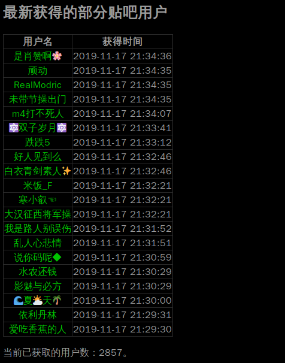
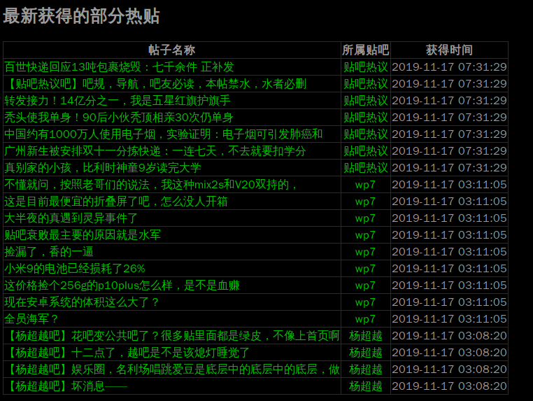
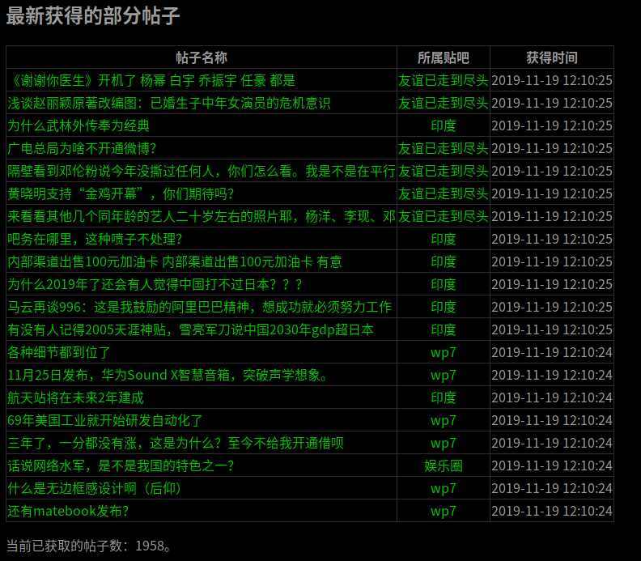

# 百度贴吧活动用户搜集

这是一个采用`PHP`编写的百度贴吧相关信息的爬虫应用，获取的是百度贴吧的公开信息。

目前实现了以下的功能：

1. 保存百度指定贴吧首页出现的用户。

2. 显示当前的热帖（通过贴吧页面HTML的meta标签解析，不是特别实时）。

3. 显示部分最新的帖子（从首页获取）。

## 安装和使用方法

使用`PHP 7`（具备`CURL`、`PDO`、`MySQL`和`mbstring`扩展）、MySQL/MariaDB以及提供Web服务（如`Nginx`或`Apache`，不需要查看页面的话就不用）的服务器足以满足要求。

假设服务器软件能满足要求，那么：

1. 配置Nginx或Apache的Web目录到此项目的public文件夹。
2. 复制项目的`config.example.php`文件为`config.php`，然后修改`config.php`内的配置。
3. 配置后台任务运行`php test.php`，或者`work.sh`脚本，用于爬数据。